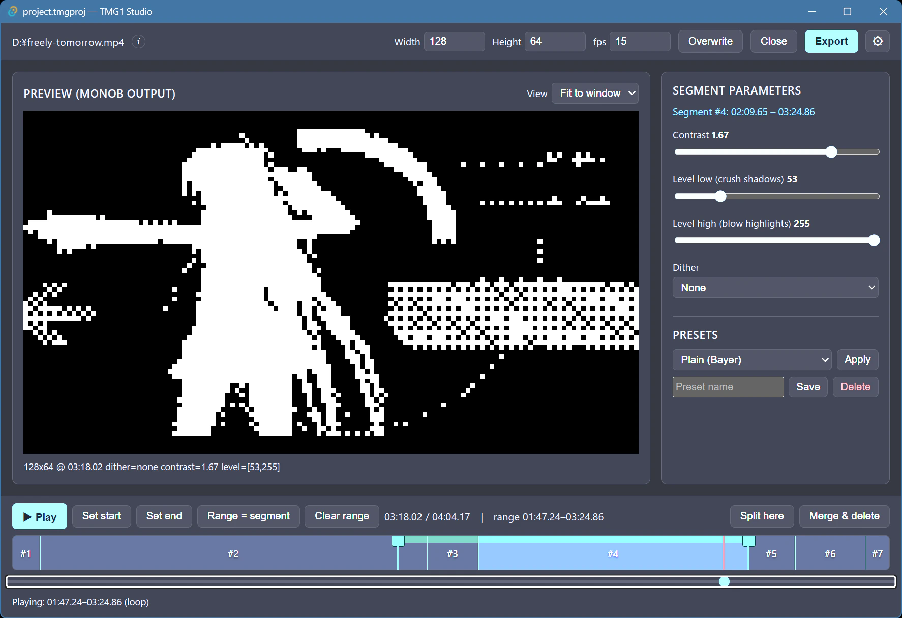

# TMG1 Studio

[English](README.md) | **日本語**

📖 **[マニュアル](https://tmg1-labs.github.io/tmg1-studio/ja/)** — スクリーンショット付きの詳しい使い方はこちら。



動画を**区間ごとに**1bit モノクロ（`monob`）化する、クロスプラットフォームな
デスクトップ GUI です。名前に「TMG1」と付いていますが、主目的はパックされた `monob`
raw ファイルの作成支援で、`.tmg1` への直接エクスポートはそこに乗せたおまけです。

全体を一律設定でモノクロ化すると、ディテール不足かノイズ増加のどちらかに寄ります。
TMG1 Studio はタイムラインを区間に分割し、コントラスト / レベル絞り / ディザを区間ごとに
調整でき、1bit `monob` の出力そのものをプレビューしながら追い込めます。生成した raw は
[TMG1](https://github.com/tmg1-labs) 形式にエンコードすれば、ESP32 の OLED で再生できます。
その TMG1 エンコードを Studio 内から（`tmg1` CLI 経由で）行い、`.tmg1` を直接出力することも
できます。

## 特長

- 動画を読み込みタイムラインをスクラブし、任意時刻の **1bit `monob` 出力**をプレビューできます。
- タイムラインを区間に分割したり、境界をドラッグしたり、区間を結合・削除したりできます。
- 区間ごとのパラメータ:
  - **コントラスト**（`eq=contrast`）
  - **レベル絞り** — 下限未満を黒潰し、上限超を白飛ばしします（暗部の孤立白点・前景の欠け対策）。
  - **ディザ** — Bayer / 誤差拡散 / なし（`-sws_dither`）。
- エクスポートは各区間を個別設定でトランスコードし、raw を無劣化連結します。出力形式は `raw` /
  `tmg1` / 両方から選べ、`tmg1` はアプリが `tmg1` CLI を呼んで raw を `.tmg1` にエンコードします
  （別途 encode 不要）。目視確認用の近傍拡大 `.preview.mp4` は任意出力です（既定オフ）。

プレビューとエクスポートは**同一のフィルタチェーン組み立て**（`src-tauri/src/filter.rs`）を
使うため、見た目と出力が一致します。

## エクスポート出力

各区間を個別設定でレンダリングし、タイムライン全体を 1 本のモノクロ結果に連結します。
主となる出力形式を選びます:

- **`raw`** — `<name>.raw` を出力します。パックされた 1bit `monob` フレームです。あとから `tmg1-cli encode` で TMG1 に変換できます。
- **`tmg1`** — `<name>.tmg1` を出力します。上の raw を TMG1 形式にエンコードしたもので、
  Studio が `tmg1` CLI を呼ぶため別途エンコードは不要です。
- **`both`** — 上記の両方を出力します。

加えて、通常のディスプレイで目視確認するための `<name>.preview.mp4`（6 倍近傍拡大）も任意で
出力できます（既定オフ）。

> [!IMPORTANT]
> フレーム幅は 8 の倍数にしてください（`monob` のバイト境界）。

## 前提

**ビルドに必要（ソースから動かす場合）**

- [Rust](https://rustup.rs/) + [Node.js](https://nodejs.org/)（18 以上）
- OS ごとの Tauri v2 [システム依存](https://tauri.app/start/prerequisites/)

**実行に必要（アプリを使うとき）**

- `ffmpeg` / `ffprobe` — `PATH` に置くか、アプリ設定で実行パスを指定
- `tmg1` 出力を使うときのみ: [`tmg1`](https://github.com/tmg1-labs/tmg1-cli) CLI — 同様に `PATH` かアプリ設定で指定

## 開発

```bash
npm install
npm run tauri dev      # アプリを起動
```

バックエンドの単体テスト（フィルタチェーン組み立て）:

```bash
cd src-tauri && cargo test
```

push/PR のチェック（`tsc` + `cargo test` + `clippy`）は `.github/workflows/ci.yml` が担います。

## 関連プロジェクト

**[TMG1 Labs](https://github.com/tmg1-labs)** の一部です。プロジェクトの全リポジトリ
一覧は組織プロフィールを参照してください。

## ライセンス

MIT
