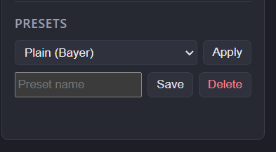

# Editing

## Working with segments

A new project starts with a single segment covering the whole clip.

- **Split** — move the playhead to the desired position and press
  **Split here**.
- **Adjust** — drag a boundary on the timeline to move it.
- **Merge** — select a segment and press **Merge & delete** to merge it
  into its neighbour. The last remaining segment cannot be deleted.

## Playback range

You can loop-play a portion of the clip while tuning:

- **Set start** / **Set end** — set the range from the playhead position.
- **Range = segment** — snap the range to the current segment.
- **Clear range** — reset the range to the whole clip.

## Per-segment parameters

Each segment has its own set of parameters, applied only within its range:

| Parameter | Effect |
| --- | --- |
| **Contrast** | Overall contrast (`eq=contrast`). |
| **Level low (crush shadows)** | Crushes everything below the threshold to black — removes stray white dots in dark areas. |
| **Level high (blow highlights)** | Blows everything above the threshold to white — fixes dropouts in the foreground. |
| **Dither** | Bayer / error diffusion (ed) / none (`-sws_dither`). |

The preview updates as you adjust, showing the exact 1-bit output.

## Presets

Save the current segment's parameters as a named preset, then **Apply** it
to other segments. Presets can be deleted when no longer needed.

