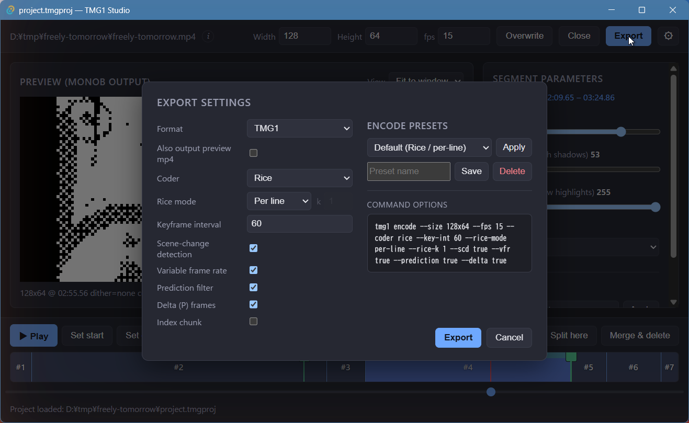
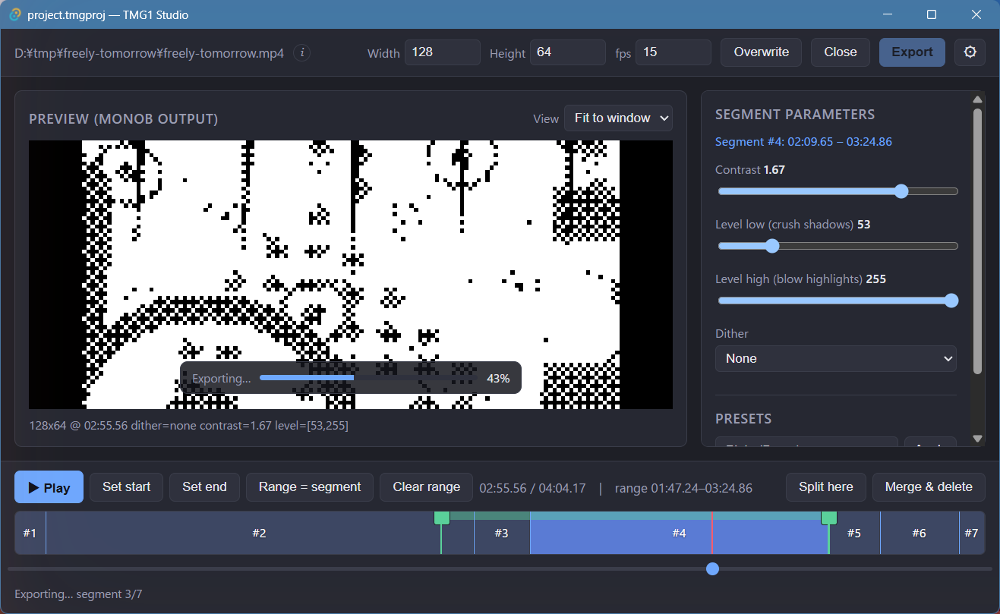
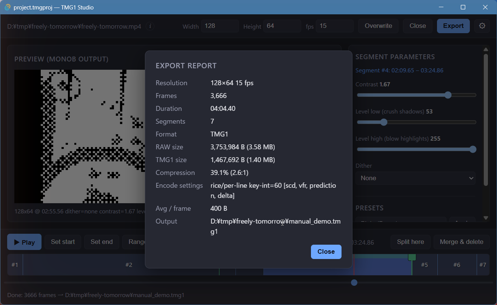

# Export

Press **Export** to open the **Export settings** dialog. Export renders
every segment with its own settings and losslessly concatenates the results
into one monochrome output for the whole timeline.

## Settings

| Setting | Meaning |
| --- | --- |
| **Format** | `RAW`, `TMG1`, or `TMG1 & RAW` (see below). |
| **Also output preview mp4** | Additionally writes `<name>.preview.mp4`, a 6× nearest-neighbour upscale for eyeballing on a normal display. Off by default. |
| **Coder** | Entropy coder used by the `tmg1` encoder. |
| **Rice mode** | Rice parameter scope: per line, per frame, or fixed `k`. |
| **Keyframe interval** | Maximum distance between keyframes. |
| **Scene-change detection** | Insert keyframes on scene changes. |
| **Variable frame rate** | Drop duplicate frames (VFR). |
| **Prediction filter** | Enable the prediction filter. |
| **Delta (P) frames** | Encode inter-frame deltas. |
| **Index chunk** | Write a seek index chunk. |

**Encode presets** save and re-apply encoder settings, and **Command
options** previews the exact `tmg1 encode` command line that will run.

## Formats

| Format | Output |
| --- | --- |
| **RAW** | `<name>.raw` — packed 1-bit `monob` frames. Encode to TMG1 later with `tmg1-cli encode`. |
| **TMG1** | `<name>.tmg1` — the raw encoded to TMG1. Studio runs the `tmg1` CLI for you; no separate encode step. |
| **TMG1 & RAW** | Both of the above. |

## Running the export

Progress is shown over the preview while each segment renders:

## Export report

When the export finishes, a report summarizes the result — resolution,
frame count, duration, segment count, format, RAW/TMG1 sizes, compression
ratio, encode settings, average bytes per frame, and the output path:

