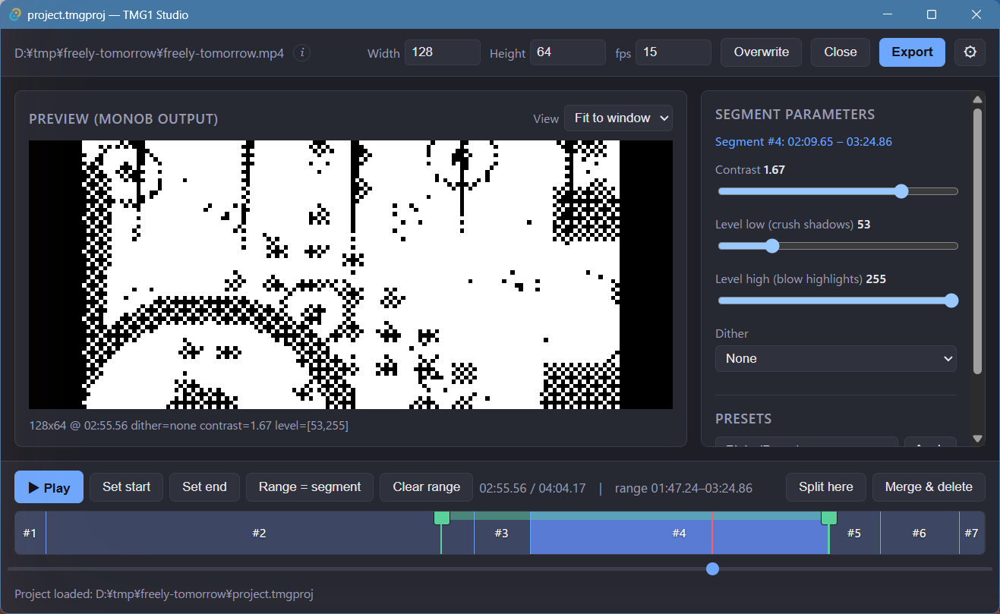

# TMG1 Studio

TMG1 Studio is a cross-platform desktop GUI for turning video into 1-bit
monochrome (`monob`) footage, tuned **per segment** of the timeline. Its main
job is authoring the packed `monob` raw file — direct `.tmg1` export is a
convenience layered on top.

A single uniform monochrome setting either loses detail or adds noise. TMG1
Studio lets you split the timeline into segments and tune contrast,
level-squeeze, and dithering independently for each, previewing the exact
1-bit `monob` result as you go. The raw can then be encoded to
[TMG1](https://github.com/tmg1-labs) and played back on an ESP32-driven OLED —
and Studio can run that encode for you, emitting a `.tmg1` directly.

## How this manual is organized

- [Getting Started](getting-started.md) — installation and required external tools.
- [Interface](interface.md) — a tour of the main window.
- [Editing](editing.md) — segments and per-segment parameters.
- [Export](export.md) — output formats and options.

## Related projects

Part of **[TMG1 Labs](https://github.com/tmg1-labs)** — see the organization
profile for all repositories in the project.
