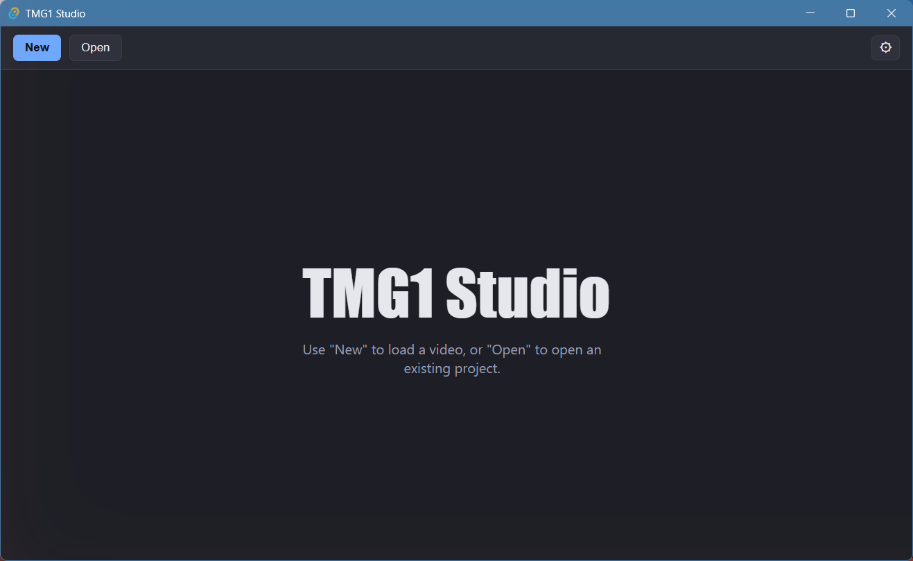
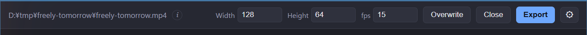
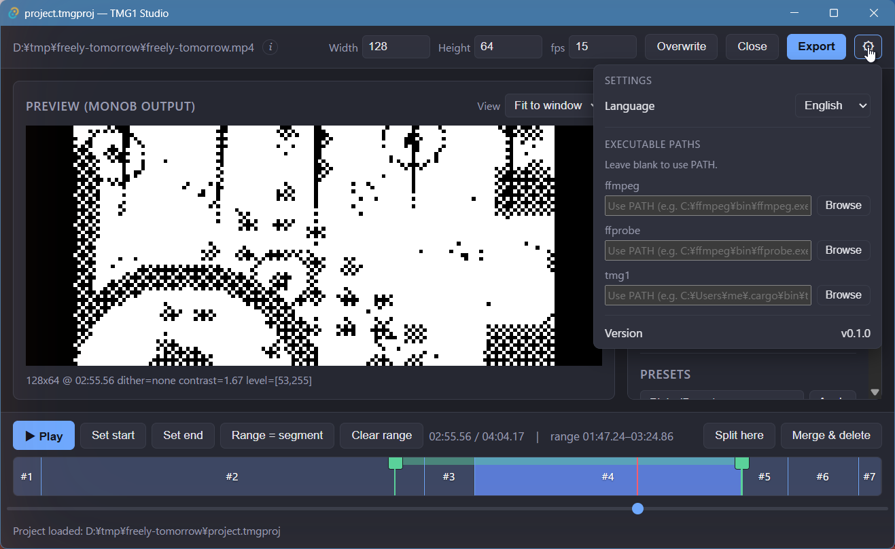
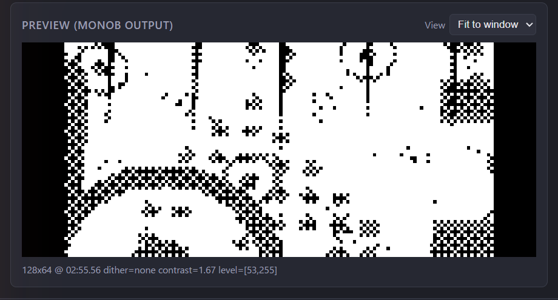
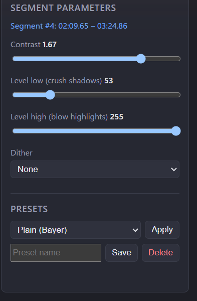
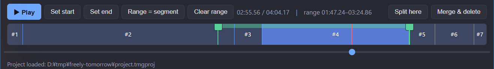

# Interface

## Start screen

When no project is open:

- **New** — load a video and start a new project.
- **Open** — open an existing TMG1 Studio project (`.tmgproj`).
- The gear icon opens [Settings](#settings).

## Toolbar (project open)

Shows the source video path, plus:

- **Width / Height / fps** — output resolution and frame rate. Width must be
  a multiple of 8.
- **Overwrite** — save the project over its current file.
- **Close** — close the project.
- **Export** — open the export settings dialog.

## Settings

Opened with the gear icon: **Language** (English / 日本語 / 简体中文) and
**Executable paths** for `ffmpeg`, `ffprobe`, and `tmg1`. Leave a path blank
to use `PATH`.

## Preview pane

**Preview (monob output)** shows the exact 1-bit `monob` result at the
current playhead position; the caption below lists the active dither,
contrast, and level values. **View** switches zoom levels or fits the
preview to the window. The same filter chain is used for preview and
export, so what you see is what you get.

## Segment parameters pane

Shows the parameters of the segment under the playhead: **Contrast**,
**Level low (crush shadows)**, **Level high (blow highlights)**, and
**Dither**. Below it, **Presets** let you save and re-apply parameter sets.
See [Editing](editing.md) for details.

## Timeline

Segments and their boundaries, with transport and range controls:
**Play** / **Set start** / **Set end** / **Range = segment** /
**Clear range**, and the segment operations **Split here** and
**Merge & delete**. The scrub bar below moves the playhead.
