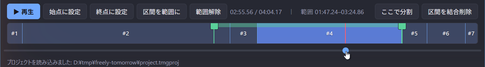
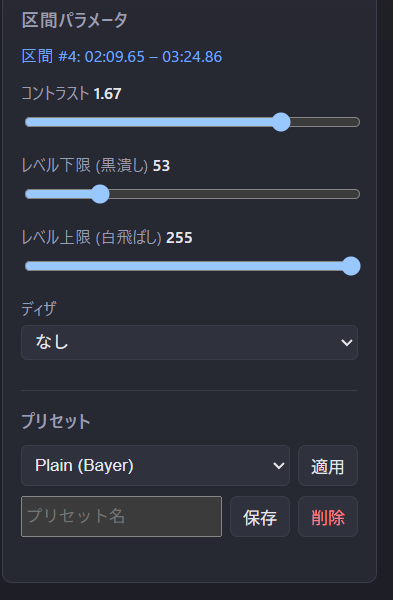
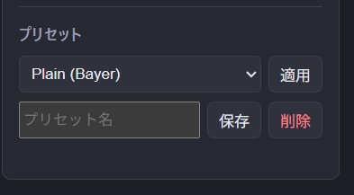

# 編集

## 区間の操作

新規プロジェクトはクリップ全体を覆う 1 つの区間から始まります。

- **分割** — 再生位置を目的の場所に移動して**ここで分割**を押します。
- **調整** — タイムライン上の境界をドラッグして動かします。
- **結合** — 区間を選んで**区間を結合削除**を押すと隣の区間に統合されます。
  最後の 1 区間は削除できません。

## 再生範囲

調整中はクリップの一部をループ再生できます:

- **始点に設定** / **終点に設定** — 再生位置から範囲を設定します。
- **区間を範囲に** — 現在の区間に範囲を合わせます。
- **範囲解除** — 範囲をクリップ全体に戻します。

## 区間ごとのパラメータ

各区間は独立したパラメータを持ち、その区間内にのみ適用されます:

| パラメータ | 効果 |
| --- | --- |
| **コントラスト** | 全体のコントラスト（`eq=contrast`）。 |
| **レベル下限 (黒潰し)** | しきい値未満を黒に潰します — 暗部の孤立白点対策。 |
| **レベル上限 (白飛ばし)** | しきい値超を白に飛ばします — 前景の欠け対策。 |
| **ディザ** | Bayer / 誤差拡散 (ed) / なし（`-sws_dither`）。 |

調整するとプレビューが即座に更新され、1bit 出力そのものを確認できます。

## プリセット

現在の区間のパラメータに名前を付けて保存し、他の区間に**適用**できます。
不要になったプリセットは削除できます。

