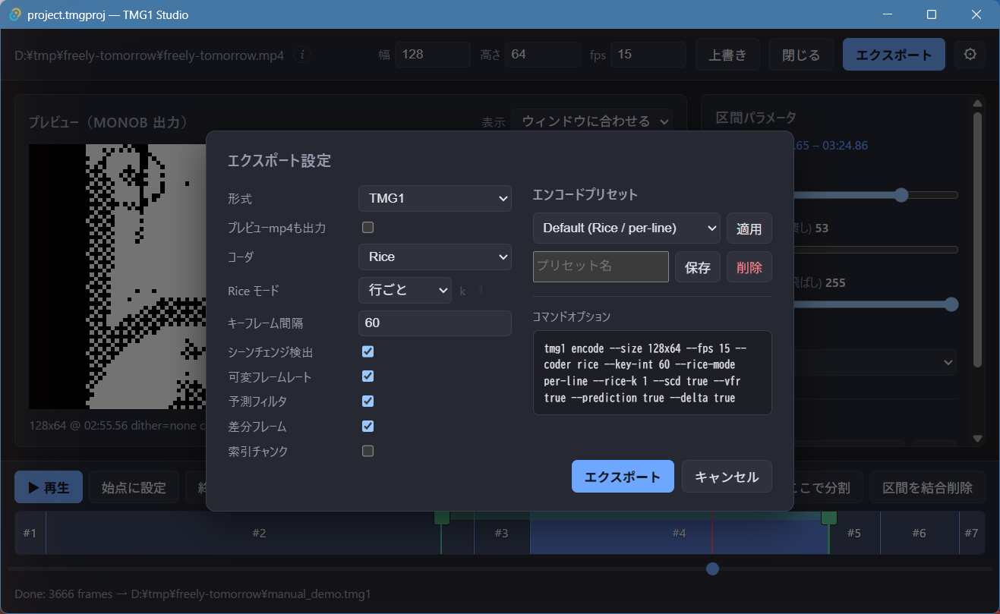
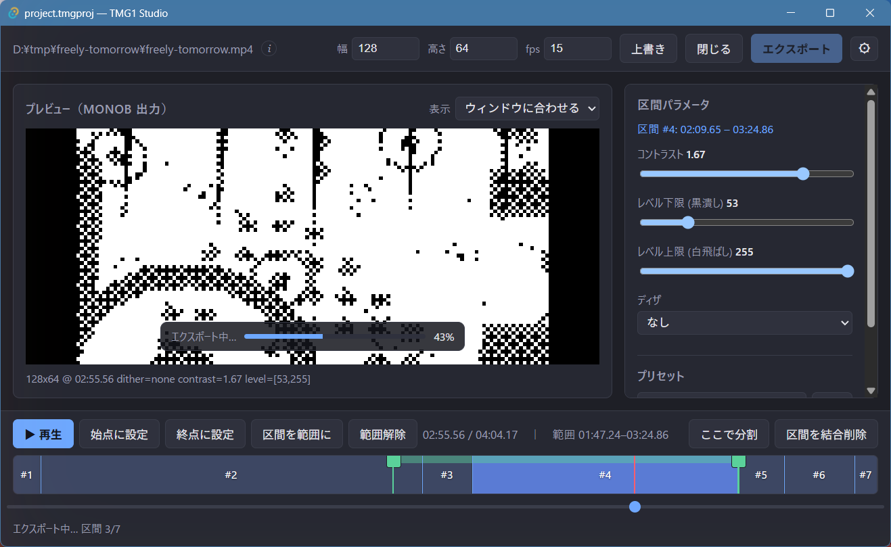
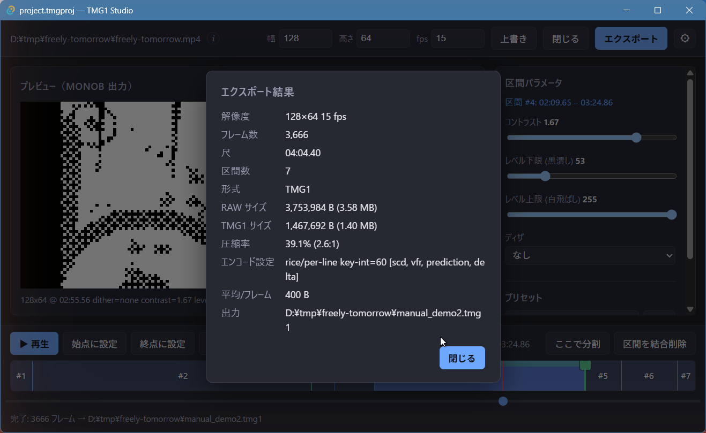

# エクスポート

**エクスポート**を押すと**エクスポート設定**ダイアログが開きます。
エクスポートは各区間を個別設定でレンダリングし、結果を無劣化で連結して
タイムライン全体を 1 本のモノクロ出力にします。

## 設定項目

| 項目 | 意味 |
| --- | --- |
| **形式** | `RAW` / `TMG1` / `TMG1 & RAW`（後述）。 |
| **プレビューmp4も出力** | 目視確認用の `<name>.preview.mp4`（6 倍近傍拡大）も出力します。既定オフ。 |
| **コーダ** | `tmg1` エンコーダが使うエントロピーコーダ。 |
| **Rice モード** | Rice パラメータの適用単位: 行ごと / フレームごと / 固定 `k`。 |
| **キーフレーム間隔** | キーフレーム間の最大距離。 |
| **シーンチェンジ検出** | シーン切り替わりでキーフレームを挿入します。 |
| **可変フレームレート** | 重複フレームを間引きます（VFR）。 |
| **予測フィルタ** | 予測フィルタを有効にします。 |
| **差分フレーム** | フレーム間差分（P フレーム）で符号化します。 |
| **索引チャンク** | シーク用の索引チャンクを書き込みます。 |

**エンコードプリセット**でエンコード設定の保存・再適用ができ、
**コマンドオプション**には実行される `tmg1 encode` のコマンドラインが
そのまま表示されます。

## 形式

| 形式 | 出力 |
| --- | --- |
| **RAW** | `<name>.raw` — パックされた 1bit `monob` フレーム。あとから `tmg1-cli encode` で TMG1 に変換できます。 |
| **TMG1** | `<name>.tmg1` — raw を TMG1 形式にエンコードしたもの。Studio が `tmg1` CLI を呼ぶため別途エンコードは不要です。 |
| **TMG1 & RAW** | 上記の両方。 |

## エクスポートの実行

各区間のレンダリング中は、プレビュー上に進捗が表示されます:

## エクスポート結果

完了すると結果レポートが表示されます — 解像度・フレーム数・尺・区間数・
形式・RAW/TMG1 サイズ・圧縮率・エンコード設定・平均バイト/フレーム・
出力パス:

