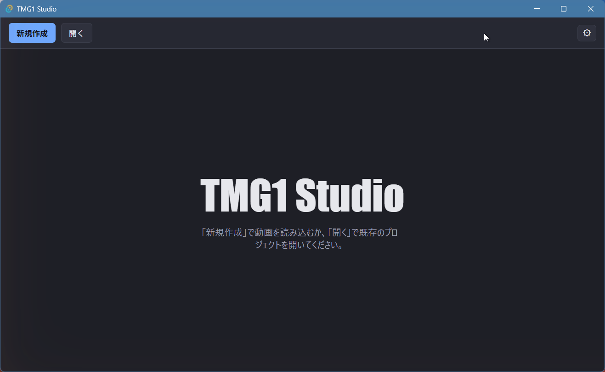
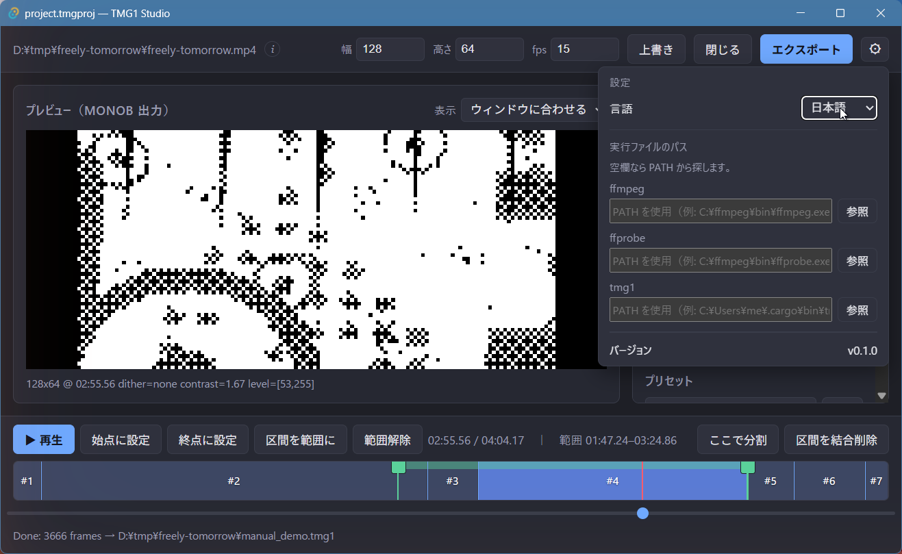

# はじめに

## 動作要件

TMG1 Studio は実行時に外部のコマンドラインツールを呼び出します:

- **`ffmpeg` / `ffprobe`** — 必須。`PATH` に置くか、アプリ設定で実行パスを
  指定してください。
- **[`tmg1`](https://github.com/tmg1-labs/tmg1-cli) CLI** — `.tmg1` 出力を
  使うときのみ必要。同様に `PATH` かアプリ設定で指定します。

!!! important
    フレーム幅は 8 の倍数にしてください（`monob` のバイト境界）。

## インストール

[Releases ページ](https://github.com/tmg1-labs/tmg1-studio/releases)から
お使いの OS 向けのインストーラをダウンロードしてください。



## ソースからのビルド

- [Rust](https://rustup.rs/) と [Node.js](https://nodejs.org/)（18 以上）
- OS ごとの Tauri v2 [システム依存](https://tauri.app/start/prerequisites/)

```bash
npm install
npm run tauri dev      # アプリを起動
```

## ツールパスの設定

`ffmpeg` / `ffprobe` / `tmg1` が `PATH` にない場合は、アプリ設定を開いて
それぞれの実行ファイルの場所を指定してください。


