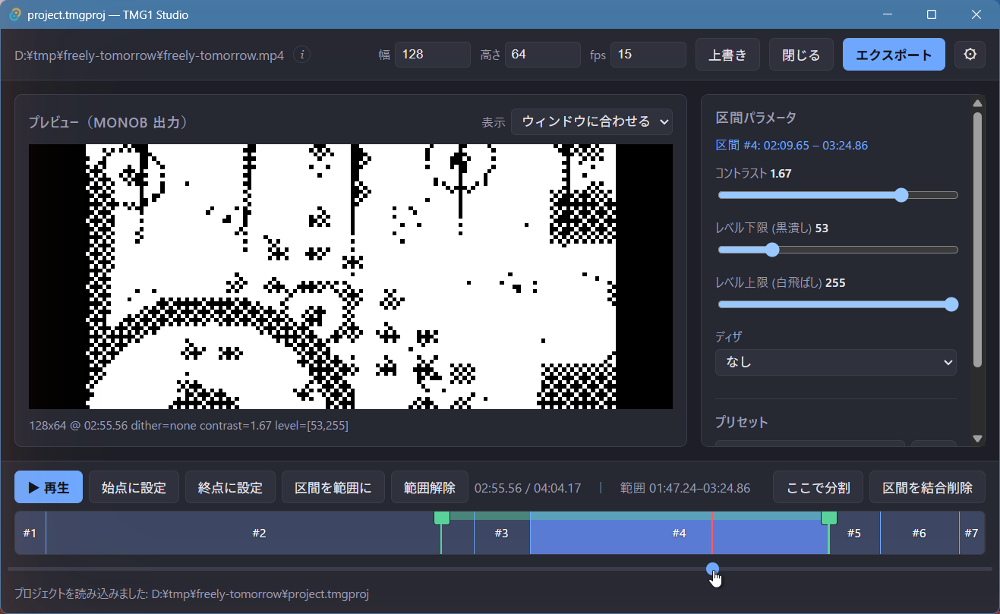

# TMG1 Studio

TMG1 Studio は、動画を**区間ごとに** 1bit モノクロ（`monob`）化する、
クロスプラットフォームなデスクトップ GUI です。主目的はパックされた `monob`
raw ファイルの作成支援で、`.tmg1` への直接エクスポートはそこに乗せたおまけです。

全体を一律設定でモノクロ化すると、ディテール不足かノイズ増加のどちらかに
寄ります。TMG1 Studio はタイムラインを区間に分割し、コントラスト / レベル絞り /
ディザを区間ごとに調整でき、1bit `monob` の出力そのものをプレビューしながら
追い込めます。生成した raw は [TMG1](https://github.com/tmg1-labs) 形式に
エンコードすれば、ESP32 の OLED で再生できます。その TMG1 エンコードを
Studio 内から行い、`.tmg1` を直接出力することもできます。

## このマニュアルの構成

- [はじめに](getting-started.md) — インストールと必要な外部ツール。
- [画面構成](interface.md) — メインウィンドウの各部説明。
- [編集](editing.md) — 区間分割と区間ごとのパラメータ。
- [エクスポート](export.md) — 出力形式とオプション。

## 関連プロジェクト

**[TMG1 Labs](https://github.com/tmg1-labs)** の一部です。プロジェクトの
全リポジトリ一覧は組織プロフィールを参照してください。
