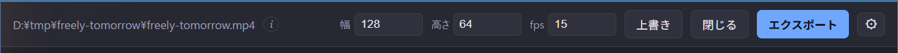
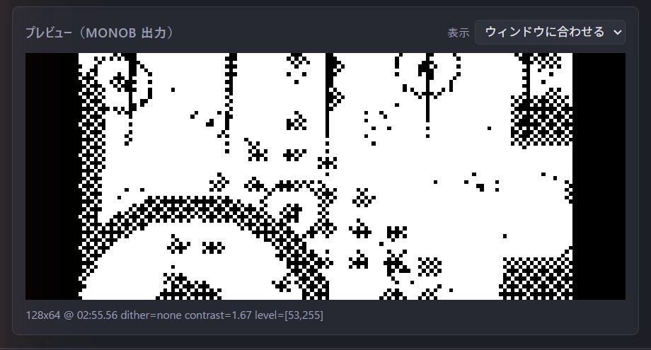

# 画面構成

## スタート画面

プロジェクトを開いていないとき:

- **新規作成** — 動画を読み込んで新しいプロジェクトを開始します。
- **開く** — 既存の TMG1 Studio プロジェクト（`.tmgproj`）を開きます。
- 歯車アイコンで設定メニューを開きます。

## ツールバー（プロジェクト表示中）

元動画のパスに加えて:

- **幅 / 高さ / fps** — 出力解像度とフレームレート。幅は 8 の倍数に
  してください。
- **上書き** — プロジェクトを現在のファイルに上書き保存します。
- **閉じる** — プロジェクトを閉じます。
- **エクスポート** — エクスポート設定ダイアログを開きます。

## 設定

歯車アイコンから開きます。**言語**（English / 日本語 / 简体中文）と、
`ffmpeg` / `ffprobe` / `tmg1` の**実行ファイルのパス**を設定できます。
空欄なら `PATH` から探します。

## プレビューペイン

**プレビュー（MONOB 出力）** には、現在の再生位置における 1bit `monob` の
出力そのものが表示され、下部に適用中のディザ・コントラスト・レベル値が
出ます。**表示**で拡大率の切り替えやウィンドウフィットが選べます。
プレビューとエクスポートは同一のフィルタチェーンを使うため、見た目と
出力が一致します。

## 区間パラメータペイン

再生位置にある区間のパラメータを表示します: **コントラスト**、
**レベル下限 (黒潰し)**、**レベル上限 (白飛ばし)**、**ディザ**。
その下の**プリセット**でパラメータ一式の保存と再適用ができます。
詳細は[編集](editing.md)を参照してください。

## タイムライン

区間と境界の表示に加えて、再生・範囲操作(**再生** / **始点に設定** /
**終点に設定** / **区間を範囲に** / **範囲解除**)と、区間操作
(**ここで分割** / **区間を結合削除**)が並びます。下のスクラブバーで
再生位置を動かせます。
